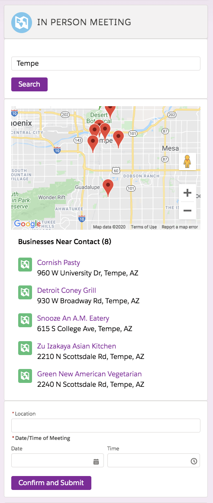

# In Person Meeting Scheduler

## Use Case:

Meeting schedule feature to meet the Contact in Person. This feature will help users to look for the nearest business of the Contact Mailing Address while the user is on the call with the contact to schedule a meeting. Users should have the ability to search for the places that Contact was interested in schedule a meeting. This feature interacts with Yelp API for the nearest business lookups.

<br/>
<br/>



## Schema:
```
Create two new fields on Contact Object

Meeting Location

  Description: To store the location of the meeting when scheduled
  Data Type: Text (150)

Meeting Date/Time

  Description Field: To store the meeting Date/Time
  Data Type: DateTime
```
## Design:

Build a Lightning Component which interacts with the Yelp Fusion API's AutoComplete API and BusinessLookup API and shows the results to UI.

### Step 1:

- Create an input to search for the business. Perform a search by calling Yelp API business search when the user hits the enter key or clicking a button next to the search input.
- Create an input to store Meeting Location which is the business Name.
- Create an input to Pick a Date Time with a calendar.

### Step 2:

- Display the business results in an interactive MAP to display it to User.
- When the user clicks on a marker in the Map it should display business details like Name and Location.

### Step 3:

- User Picks the Date/Time when the Contact would like to meet and types location based on map results.

### Step 4:

- On Save from the quick action, the information Meeting Location Name, Meeting DateTime should be updated to the Contact Record.
